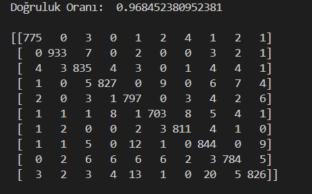

# Handwritten Digit Recognition with SVM

This project is a simple **handwritten digit recognition** application using **Support Vector Machine (SVM)**. The application allows users to draw a digit on a Tkinter canvas, processes the image, and predicts the digit using a trained SVM model.

## Features

- **Interactive Drawing Canvas**: Users can draw digits using a brush.
- **Preprocessing**: The drawn image is resized to **28x28**, converted to grayscale, and scaled for the model.
- **Prediction**: The trained **SVM model** predicts the digit.
- **Clear Function**: Allows users to reset the canvas.

## Installation

1. Clone this repository:
   ```bash
   git clone https://github.com/aeren23/-Handwritten-Digit-Recognition-with-SVM-in-Python.git
   cd -Handwritten-Digit-Recognition-with-SVM-in-Python
   ```
2. Install dependencies:
   ```bash
   pip install -r requirements.txt
   ```
3. Run the application:
   ```bash
   python project.py
   ```

## Dependencies

- **Python 3.x**
- **Tkinter**
- **NumPy**
- **OpenCV**
- **Pillow**
- **Scikit-learn**
- **Joblib**

## Usage

1. Draw a digit on the black canvas.
2. Click the **Predict** button.
3. The model will predict the drawn digit and display the result in the terminal.
4. To clear the canvas, click **Clear**.

## Project Files

- **train.py**: Trains the model used in the project.
- **testModel.py**: Splits the dataset into **80%-20%**, tests the model, and generates the **accuracy score** and **confusion matrix**.
- **testModelPkl.py**: Tests the trained model with pre-existing images.
- **project.py**: Contains the main project code.

## Model Information

- The model is trained using **Support Vector Machine (SVM)**.
- The dataset used for training is **MNIST**.
- The input images are preprocessed to **28x28 grayscale** format and scaled.

## Model Performance

Below is the **confusion matrix** showing the performance of the model:



## Contributing

If you want to improve this project, feel free to **fork** the repository and submit a **pull request**.

## License

This project is licensed under the **MIT License**.

---

**Author**: Ali Eren Oğuztaş  
GitHub: [aeren23](https://github.com/aeren23)

